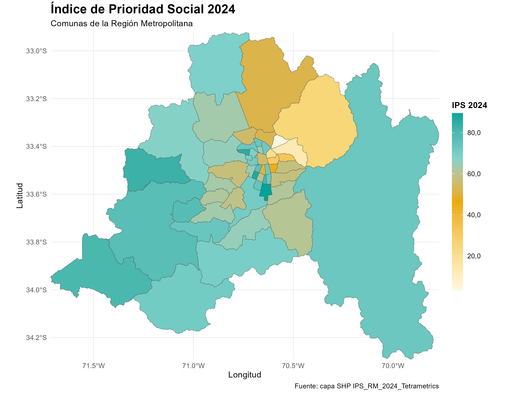

# Mapa-Georreferencial-IPS-RM-2024-

Implementación Computacional/Teórica de un mapa Georreferencial interactivo en Rstudio. Se comienza de la base o implementación gráfica realizada para los cursos de Métodos Multivariantes y Taller 1 (Practica Interna).

## 🗺️ Visor Interactivo

**¡Haz clic en la imagen a continuación para abrir el mapa interactivo a pantalla completa!** Podrás hacer zoom, cambiar el mapa base y ver los datos exactos por comuna.

